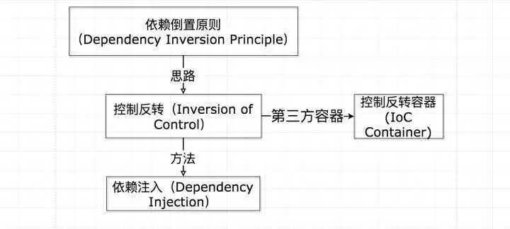

# Design Patten
## Tool Box
### OO基础
- 抽象
- 封装
- 多态
- 继承
### OO原则
- 开放-关闭原则：类应该对拓展开放，对修改关闭
- 封装变化
- 多用组合、少用继承
- 针对接口编程，不针对实现编程
- 为交互对象之间的松耦合设计而努力
#### 依赖倒置 Dependency Inversion Principle

在类A的内部去实例化类B，那么两者之间会出现较高的耦合

要依赖抽象，不要依赖具体类
- 变量不可以持有具体类的引用
- 不要让类派生自具体类
### OO模式
#### 策略模式

#### 观察者模式

#### 装饰者模式